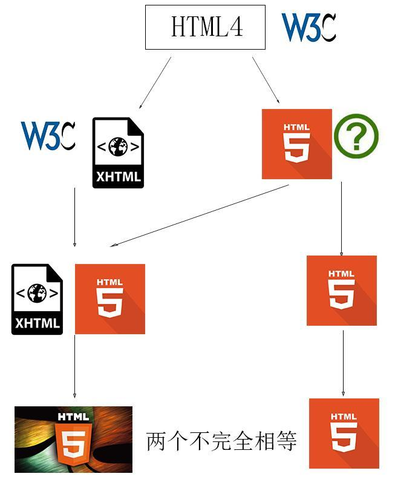

<!-- HTML 发展史 -->

- **1993**

> IETF（互联网工程任务组）发布了第一个HTML草案，而且还是通过因特网草案的形式发布，所以当时并没有人鸟它，因此这个HTML1.0并没有被大众承认，但为了好排名，只好给个名分它。

- **1995**

> IETF继续发布了HTML2.0，这也是首次被大众所认可，HTML2.0实际上是各个版本的超集，当时各大浏览器厂商有自己独特的标准，这些标准互不兼容，谁也不服谁，很明显给开发带来极大的困难。于是IETF干脆当了一次和事佬，将一些优秀的标准集合在一起，希望让大家一起遵守。虽然大佬级别的任然不鸟它，可却得到了二、三阶梯的浏览器厂商们支持并拥护。

- **1997**

>随着层出不穷的标准推出，标准统一化的工作很艰难。W3C终于出来主持大局,取代IETF，成为HTML的标准组织，发布了HTML3.2推荐标准。W3C靠着一系列的手段，让大佬们都得往自己的标准兼容，就连顽固不化的IE，也得要部分兼容。

- **1999**

>在新千年前，W3C推出了HTML 4.01。这一年让HTML到达了它的第一个高潮。该推荐版本就是我们熟知的HTML的第四个标准版本,可以说是现代HTML5的基石。已经被大部分浏览器厂商采纳，开发人员只需要按照该标准进行开发即可。从1993-1999之间短短的6年时间，HTML语言有着很大的发展，基于诸多人的努力，终于产生了我们现在用的HTML语言。

- **2000**

>在新千年的开始，W3C决定搞事情。当时CSS3刚崛起，因为CSS一直是由W3C规划升级版本，语法规则比较单一标准；而HTML接手比较晚，导致HTML的语法规则很松散，能自动包容错误，不能称之为严格的规范。正好当时有一款语言XML，语法规则很严谨，并且可以实现同样的功能用于网页展示，所以W3C希望XML能够替代HTML，但是W3C担心严谨的语法规则会让浏览器厂商和程序编写人员一时间接受不了，所以就发布了一个过渡版本XHTML1.0，然后再向XML转变。

- **2004**

>W3C试图用严格的标准来使互联网发展更加规范。出发点虽好，但效果不佳，因为改用XHTML标准将导致互联网99%的HTML网页需要重写。所以Opera、Mozilla基金会、苹果这些浏览器厂商则组建了民间组织WHATWG。WHATWG希望标准应当具备向后兼容性，能够跟随市场及技术的发展而动态调整，所有的改动改善都是HTML5,宽松的写法；而不希望是W3C制定一个死的标准，颁布之后再不修改，添加只能发布新版本 5.1,5.2等，严格的写法增加开发人员的负担；HTML由此分裂成两个阵营的版本。

- **2006**

>在W3C还在争论是XHTML2还是HTML5的时候，互联网格局已经发生了变化。人们不再满足看新闻和发邮件，更多的时候看流视频和网页游戏。此时此刻HTML正处于内战当中，这块新需求功能就被Adobe的Flash抢去了。Adobe通过Flash不仅攫取了大量的财富，而且也狠狠打了W3C的一巴掌。于此同WHATWG在HTML上取得突破性进展。W3C为了尽快夺回Adobe抢占的市场，也为了自身的话语权，转而与WHATWG合作，一边推行以WHATWG的成果作为基础的HTML5，另一边则推行自家的XHTML2.0。

- **2008**

>第一个HTML5草案诞生。同年，IE、Chrome、Firefox、Safari几大浏览器巨头开始相继支持HTML5。

- **2009**

>W3C宣布终止XHTML2的项目，解散了XHTML团队。HTML 5既支持松散语法，也支持XHTML1般的严格语法。

- **2014**

>W3C发布了历时8年定稿的html5推荐标准 ，也就是html第五个标准版本。此后也发布了5.1、5.2版本。

------

W3C开发完html4以后，开发下一代html的时候，把亲儿子抛弃了，扶持干儿子XHTML。苹果公司、Mozilla基金会等不忍心，于是另起炉灶创立了民间组织WHATWG，继续抚养html。后来W3C的干儿子不争气，html则在WHATWG抚养下越发强大，W3C见状便和WHATWG合作（威逼），把培养好的亲儿子html接回来，当做下一代的html标准，因为亲爹（W3C）和干爹(WHATWG)对于html发展道路有不同的看法，这也导致了现存了两套html的标准，这也是导致兼容性问题出现的根本原因。

